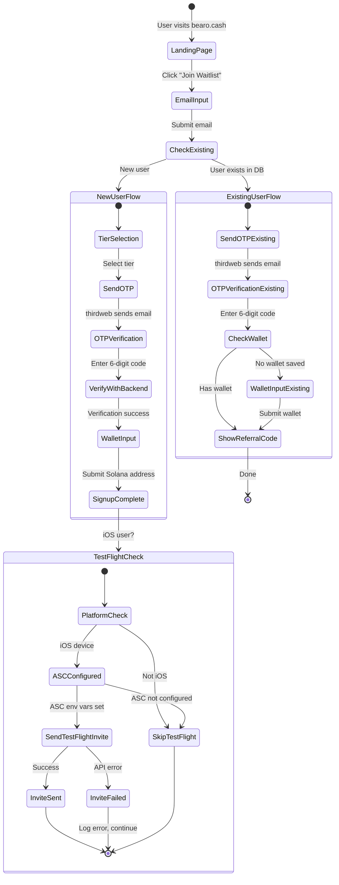
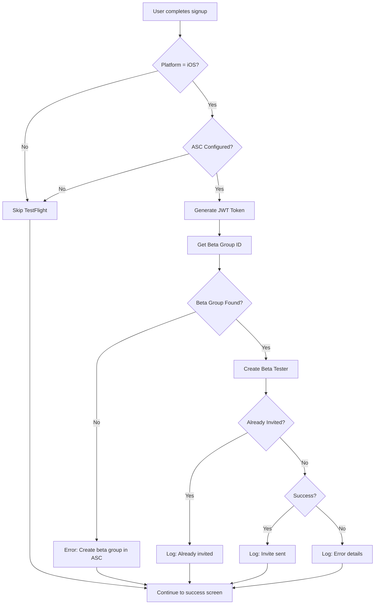

# Waitlist Automation State Machine

## Domain Configuration
| Domain | Project | Status |
|--------|---------|--------|
| bearo.cash | bearo-landing-nextjs | ✅ Active |
| www.bearo.cash | bearo-landing-nextjs | ✅ Active |
| bearo.money | bearo-landing-nextjs | ✅ Active |
| www.bearo.money | bearo-landing-nextjs | ✅ Active |

---

## User Flow State Machine



---

## Component Status

### ✅ READY - Fully Operational

| Component | Location | Status | Notes |
|-----------|----------|--------|-------|
| Landing Page | bearo.cash | ✅ | Deployed, working |
| Email Input | Hero.tsx | ✅ | Captures email |
| Tier Selection | TierSelector.tsx | ✅ | 6 tiers with spot limits |
| thirdweb OTP | lib/api.ts | ✅ | Email verification working |
| Supabase Signup | api/signup/route.ts | ✅ | Writes to waitlist table |
| Wallet Input | WalletInput.tsx | ✅ | Solana address capture |
| Referral System | api/signup/route.ts | ✅ | Codes generated, links work |
| Platform Detection | lib/deviceDetection.ts | ✅ | Detects iOS/Android/Desktop |

### ⚠️ DEPLOYED BUT NEEDS TESTING

| Component | Location | Status | Notes |
|-----------|----------|--------|-------|
| TestFlight Invite | lib/appStoreConnect.ts | ⚠️ | Code deployed, never tested E2E |
| ASC JWT Auth | lib/appStoreConnect.ts | ⚠️ | jose dependency added, untested |
| Beta Group Fetch | lib/appStoreConnect.ts | ⚠️ | Assumes beta group exists |

### ❓ PREREQUISITES FOR TESTFLIGHT

| Requirement | Status | How to Check |
|-------------|--------|--------------|
| APP_STORE_CONNECT_KEY_ID | ✅ Set | Vercel env vars |
| APP_STORE_CONNECT_ISSUER_ID | ✅ Set | Vercel env vars |
| APP_STORE_CONNECT_PRIVATE_KEY | ✅ Set | Vercel env vars (base64) |
| APP_STORE_CONNECT_APP_ID | ✅ Set | Vercel env vars |
| External Beta Group in ASC | ❓ Unknown | Check App Store Connect |
| App uploaded to TestFlight | ❓ Unknown | Check App Store Connect |

---

## TestFlight Automation Flow



---

## To Test E2E TestFlight Automation

### Prerequisites
1. Open App Store Connect: https://appstoreconnect.apple.com
2. Navigate to your app → TestFlight
3. Ensure there's an **External Testing** beta group created
4. Ensure a build is uploaded and approved for external testing

### Test Steps
1. Visit **bearo.cash** on an **iOS device** (or Safari with mobile user agent)
2. Enter a test email (use your Apple ID email)
3. Select a tier → Complete OTP verification → Enter wallet
4. Check Vercel logs for TestFlight result
5. Check your email for TestFlight invite

### Expected Logs (Vercel)
```
✅ [API] test@example.com signed up: Community, code: BEARXXXX, platform: ios
📱 [TestFlight] Invite sent to test@example.com
```
OR
```
📱 [TestFlight] Invite sent to test@example.com (already invited)
```

---

## RPC Infrastructure Scaling Plan

### Current State
- Primary RPC: Alchemy (EXPO_PUBLIC_ALCHEMY_API_KEY)
- Used for: Wallet balances, transaction submission, chain queries

### Scaling Recommendations

| User Count | RPC Strategy | Cost Estimate |
|------------|--------------|---------------|
| 0-1,000 | Alchemy Free Tier | $0/month |
| 1,000-10,000 | Alchemy Growth Plan | $49-199/month |
| 10,000-50,000 | Multi-provider (Alchemy + QuickNode) | $200-500/month |
| 50,000+ | Dedicated nodes + Load balancer | $1,000+/month |

### Quick Wins
1. **Add fallback RPCs** - QuickNode, Infura as backups
2. **Implement request caching** - Cache balance queries for 30s
3. **Use batch requests** - Bundle multiple RPC calls
4. **Rate limit per user** - Prevent single users from overwhelming

### Action Items
- [ ] Add QUICKNODE_RPC_URL as backup
- [ ] Implement RPC health checks and auto-failover
- [ ] Add request caching layer (Redis or in-memory)
- [ ] Monitor RPC latency in Sentry

---

## Files Reference

| File | Purpose |
|------|---------|
| `components/Hero.tsx` | Main signup flow UI |
| `components/TierSelector.tsx` | Tier selection modal |
| `components/EmailVerification.tsx` | OTP input modal |
| `components/WalletInput.tsx` | Solana wallet input |
| `lib/api.ts` | Frontend API client (thirdweb auth) |
| `lib/deviceDetection.ts` | Platform detection |
| `lib/appStoreConnect.ts` | TestFlight API integration |
| `app/api/signup/route.ts` | Backend signup handler |
| `app/api/waitlist/route.ts` | Waitlist stats API |
